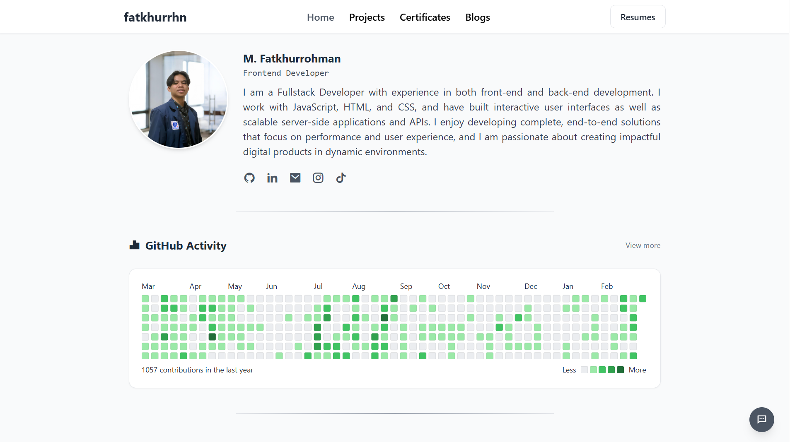

# 🚀 Fatkhurrhn - Fullstack Developer Portfolio



> Personal portfolio website showcasing my journey as a Fullstack Developer. Built with modern web technologies to demonstrate my skills, projects, and passion for development.

## ✨ Live Demo

🔗 [Visit My Portfolio](https://portfolio-fadev.vercel.app) *(sesuaikan dengan domainmu)*

## 🛠️ Tech Stack

### Frontend
- **React 18** - UI Library
- **Vite** - Build Tool & Development Server
- **TailwindCSS** - Styling & Animations
- **React Router DOM** - Navigation & Routing
- **Firebase** - Authentication & Database

### Development Tools
- **ESLint** - Code linting
- **PostCSS** - CSS processing
- **Vercel** - Hosting & Deployment

## 📂 Project Structure

📦 fadev-portfolio
├── 📁 public
│ ├── 📁 assets
│ │ ├── 📁 mentahan-video/ # Background videos
│ │ ├── *.png # Project images & assets
│ │ └── *.jpg # Profile pictures
│ ├── 📁 cv/ # Downloadable CV files
│ ├── favicon.png
│ ├── sitemap.xml
│ └── robots.txt
├── 📁 src
│ ├── 📁 components
│ │ ├── 📁 common/ # Reusable components
│ │ ├── BlogSection.jsx
│ │ ├── ProjectsSection.jsx
│ │ └── ...
│ ├── 📁 data/ # Static data files
│ ├── 📁 layout/ # Layout components
│ ├── 📁 pages
│ │ ├── 📁 admin/ # Admin dashboard pages
│ │ ├── HomePage.jsx
│ │ ├── Project.jsx
│ │ ├── Blog.jsx
│ │ └── ...
│ ├── App.jsx
│ ├── firebase.js # Firebase configuration
│ └── main.jsx
└── ...

## 🌟 Key Features

### 🎨 Frontend Development
- **Responsive Design** - Fully responsive across all devices
- **Interactive UI** - Smooth animations and transitions
- **Dynamic Content** - Real-time updates with Firebase

### 📱 Main Pages
- **Home** - Personal introduction and overview
- **Projects** - Showcase of my best work
- **Blog** - Technical articles and insights
- **Resume** - Professional experience and skills
- **Certificates** - Achievements and certifications
- **Guestbook** - Interactive visitor messages
- **GitHub Activity** - Live GitHub contributions
- **Chat Room** - Real-time communication

### 🔐 Admin Dashboard
- Secure login system
- Manage projects (CRUD operations)
- Manage certificates
- Blog post management
- Anime content management
- Quotes management
- Audio files management
- Reels management

### 🎥 Media Integration
- Video backgrounds from `/mentahan-video`
- Responsive image galleries
- PDF viewer for certificates and CV

## 🚀 Quick Start

### Prerequisites
- Node.js (v18 or higher)
- npm or yarn
- Firebase account (for backend features)

### Installation

1. **Clone the repository**
```bash
git clone https://github.com/fatkhurrhn/fadev-portfolio.git
cd fadev-portfolio
```

2. **Install dependencies**
```bash
npm install
# or
yarn install
```

2. **Environment Setup**
Create a .env file in the root directory:
```bash
VITE_FIREBASE_API_KEY=your_api_key
VITE_FIREBASE_AUTH_DOMAIN=your_auth_domain
VITE_FIREBASE_PROJECT_ID=your_project_id
VITE_FIREBASE_STORAGE_BUCKET=your_storage_bucket
VITE_FIREBASE_MESSAGING_SENDER_ID=your_sender_id
VITE_FIREBASE_APP_ID=your_app_id
```

2. **Run development server**
```bash
npm run dev
# or
yarn dev
```

2. **Build for production**
```bash
npm run build
# or
yarn build
```
